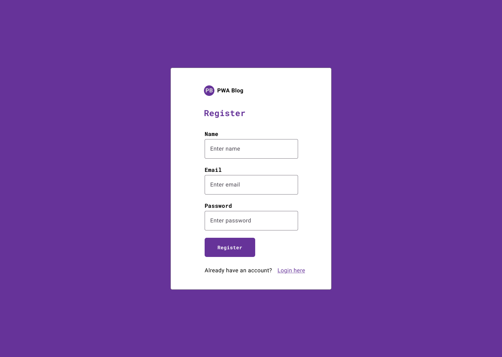

# Prototype

## Wireframes

* Register 
* Login 
* Home 
* Blog Post Details 
* Create Blog Post 
* Manage comments 
* Profile 
* Manage Users 
* Create User 
* Update User 

## Mockups

* Register 
* Login 
* Home 
* Blog Post Details 
* Create Blog Post 
* Manage comments 
* Profile 
* Manage Users 
* Create User 
* Update User 
